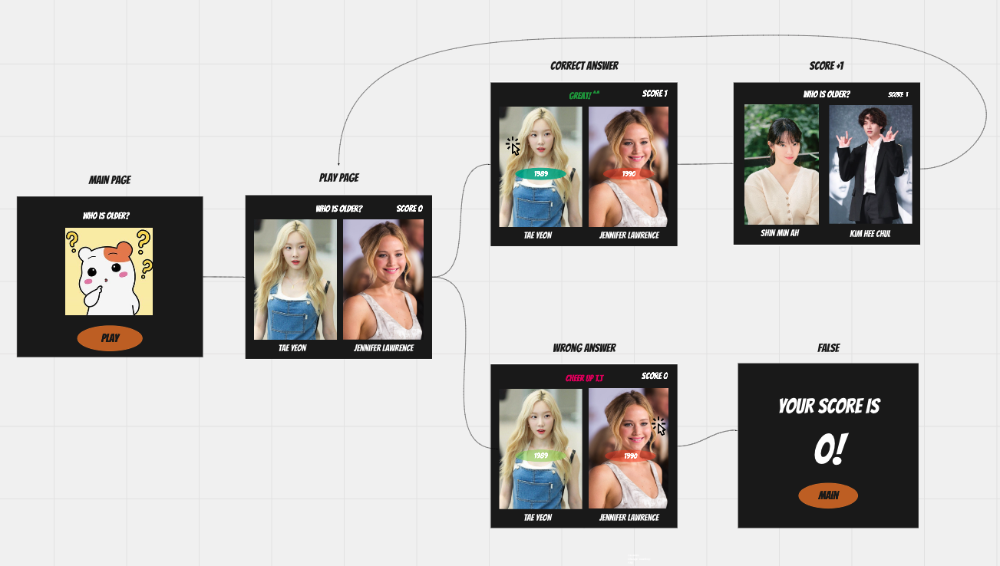

# Read Me

## 🙋‍♀️ 개발배경

Section2까지의 내용을 복습을 위해 매일 새벽 6시 부터 8시까지 진행한 새벽 스터디 프로젝트!  
whoisolder는 인물 사진만 보고 누가 더 나이가 많은지 맞추는 게임입니다.

처음 시작한 프로젝트로 일반적인 웹사이트가 아닌 게임을 선택한 이유는  
기본적인 HTML, CSS, React에 더해  
다른 웹사이트와 달리 다양한 알고리즘도 사용할 수 있기 때문입니다.
<br>
<br>

## 🎮 게임 진행




<br>
<br>

## 🧑‍💻 게임 실행 방법

1. 파일을 다운
2. 해당 폴더 터미널에서 npm install 입력

```shell
$ npm install
```

3. npm start를 입력하면 게임 실행

```shell
$ npm start
```

<br>
<br>

## 🤼‍♀️ 참여멤버

<table>
    <tr>
        <td align="center" width="130px" height="160px">
            
            <br>
            <a href='https://github.com/imdex1009'>rec.fffixing</a>
        </td>
       <td align="center" width="130px" height="160px">
            
            <br>
            <a href='https://github.com/heokiro'>heokiro</a>
        </td>
        <td align="center" width="130px" height="160px">
            
            <br>
            <a href='https://github.com/cherishxyun'>cherishxyun</a>
        </td>
    </tr>
    <tr>
      <td align="center">
        <span></span>
        <a href='https://coding-bot.tistory.com/'>Blog</a>
       </td>
      <td align="center">
        <a href='https://heokiro.tistory.com/'>Blog</a>
      </td>
      <td align="center">
        <a href='https://high-developer.tistory.com/'>Blog</a>
        </td>
    </tr>
</table>
